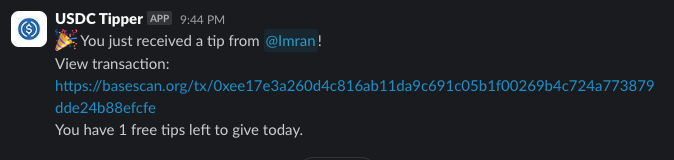
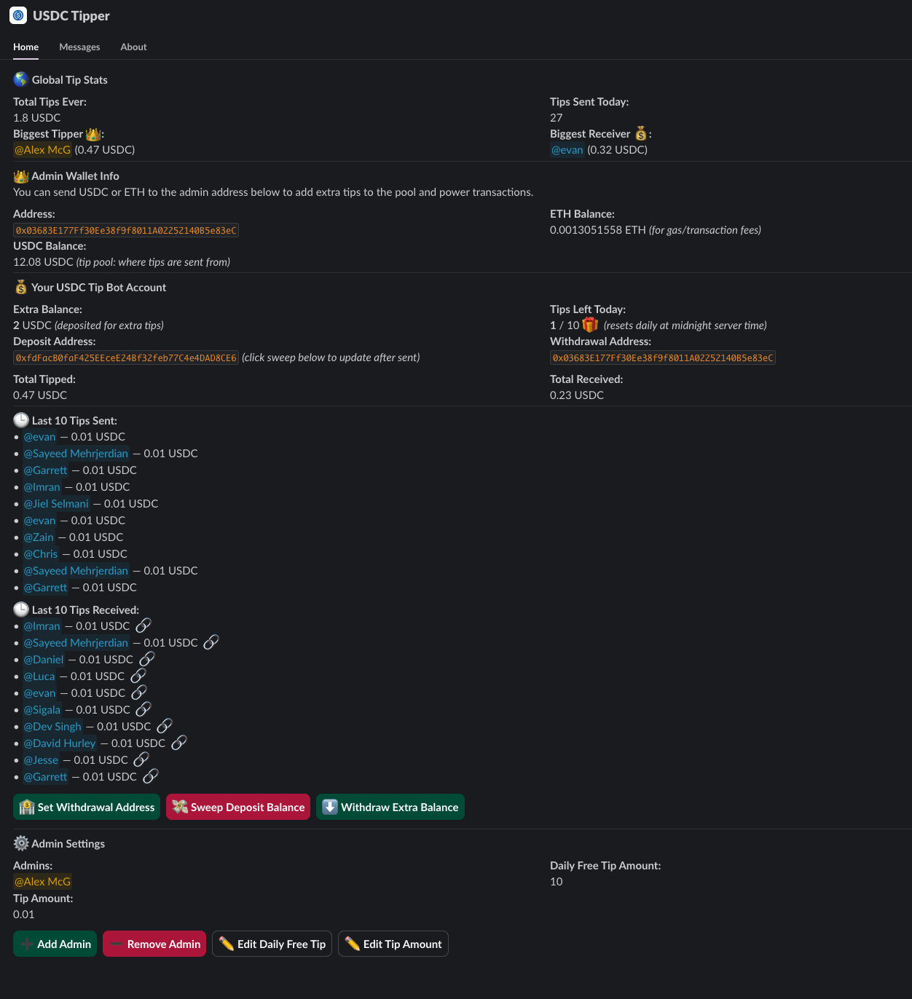

# Slack Tipping Bot

A Slack bot that enables users to tip each other small amounts of USDC (on Base blockchain) by reacting to messages with a dollar emoji 💵. The bot is designed for minimal friction, privacy, and ease of use.



# Self-hosting & Bot Setup

[Bot setup guide](./docs/bot-setup-guide.md)

Click below to host instantly:

[](https://railway.com/deploy/ZogUZJ?referralCode=fQRD5i)


## Features

- Tip other Slack users by reacting to their messages with a dollar emoji (`:dollar:` === 💵).
- Configurable daily free tip quota (Y x $0.01 USDC per user).
- Tips are held in an admin wallet until users set a withdrawal address.
- Withdrawals: users can set their Ethereum address to receive accrued tips.
- Optional: users can request a unique deposit address to top up their tipping balance.
- USDC transfers use EIP-3009 for gasless transactions (no ETH required).
- Minimal Slack permissions and privacy-focused design.

Each user has their own bot home tab where they can see their tipping balance, set their withdrawal address, and view their tipping history.


## Tech Stack

- **Node.js** with **TypeScript** backend
- **Slack API** using the official [@slack/bolt](https://slack.dev/bolt-js/) SDK
- **Base blockchain** for USDC transfers
- **USDC** (ERC-20, using EIP-3009 for gasless transfers)
- **Admin wallet** (holds all USDC until users set withdrawal addresses)
- **viem** for blockchain interactions
- **Prisma** for database ORM

## Project Structure

- `src/bot/` — Slack bot logic
  - `homeTab.ts` — Slack Home tab UI and logic
  - `slackClient.ts` — Slack API client helpers
  - `tipping.ts` — Handles tipping logic and quota checks
- `src/blockchain/` — Blockchain and wallet utilities
  - `wallet.ts` — Admin wallet and HD wallet logic
  - `tx-queue.ts` — Transaction queue for serializing blockchain operations
- `src/db/` — Database client (Prisma) and admin setup
  - `prismaClient.ts` — Prisma client instance
  - `setupAdmins.ts` — Admin user setup logic
- `src/utils/` — Utility functions
- `src/USDCAbi.ts` — USDC contract ABI
- `src/index.ts` — Entry point, initializes the bot

## Permissions

- The bot requires the following minimal Slack scopes:
  - `reactions:read` — Detect emoji reactions for tipping
  - `chat:write` — Send messages and DMs
  - `users:read` — Map Slack users and fetch user info
  - `im:write` — Initiate and send DMs to users
  - `app_home:read` — Read events from the App Home tab
  - `app_home:write` — Publish and update the App Home tab UI

## Main Flows

### 1. Tipping via Emoji Reaction
- User reacts to a Slack message with a dollar emoji ($ or :dollar:).
- Bot checks:
  - Tipper is not tipping their own post.
  - Tipper has not exceeded their daily free tip quota (5 x $0.01 USDC).
  - Tipper is not tipping a bot or non-human account.
  - No duplicate tipping on the same message by the same user.
- If eligible, $0.01 USDC is credited to the message author's balance (held in admin account).
- If not eligible, bot sends a DM explaining why.

### 2. User Withdrawal Address
- Users do **not** need a wallet to receive tips.
- Tips are held in the admin account, mapped to each user's Slack ID.
- To withdraw, a user replies to the bot with their Ethereum address.
- Upon setup:
  - All accrued USDC is sent to the user's address.
  - All future tips are sent directly to the user's address.

### 3. User Deposit Address (Optional)
- Users can request a unique deposit address to top up their tipping balance.
- Deposit addresses are derived from the admin wallet using the HD standard.
- Deposited USDC is credited to the user's tipping balance.

### 4. USDC Transfers
- Bot uses EIP-3009 to move USDC from the admin account to user addresses without requiring ETH for gas.

## Scenarios Where Tips Are Not Sent
- User tries to tip their own post.
- User has exhausted their daily free tip quota.
- User tries to tip a bot or non-human account.
- Duplicate tipping on the same message by the same user.
- Message is in a channel or context where the bot is not allowed.

## Security & Privacy
- User balances are mapped by Slack ID and not publicly visible.
- Only the admin wallet holds funds until withdrawal addresses are set.
- Minimal permissions and data retention.

## Development

1. Install dependencies:
   ```sh
   pnpm install
   ```
2. Set up environment variables (see `.env.example` if present).
3. Run database migrations:
   ```sh
   pnpm prisma migrate dev
   ```
4. Start the bot:
   ```sh
   pnpm start
   ```
5. Run tests:
   ```sh
   pnpm test
   ```

## Tipping Process Sequence Diagram


---

**Status:** In Development

---
