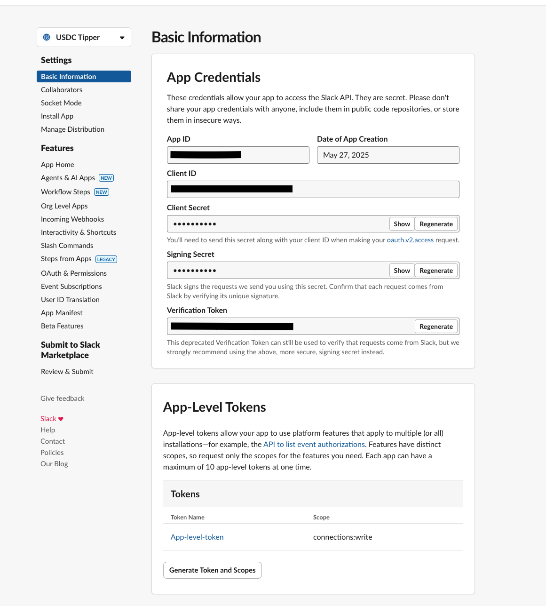
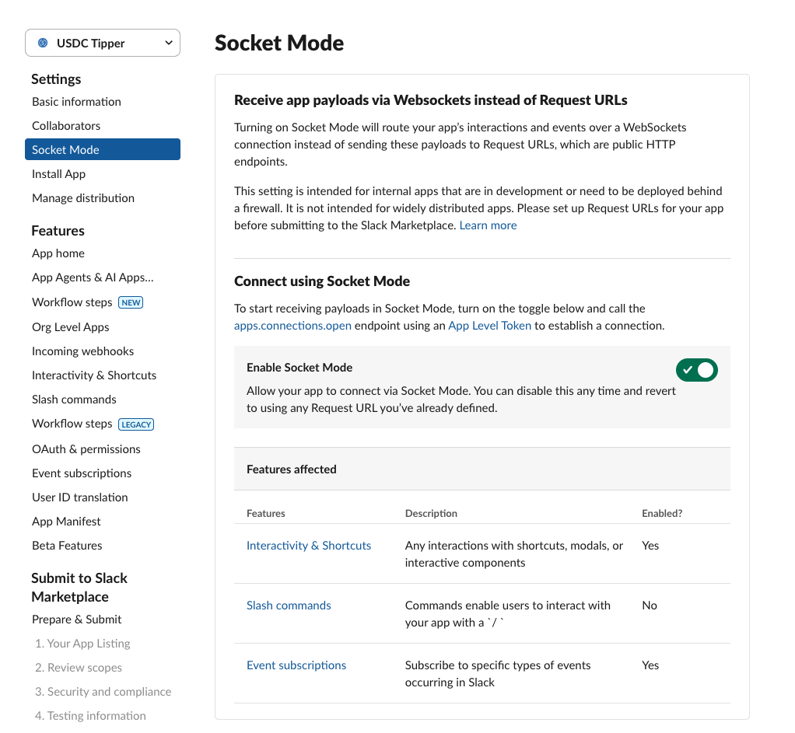
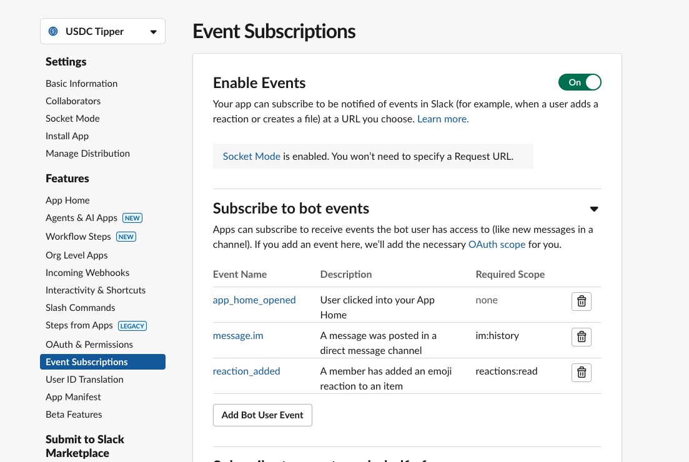
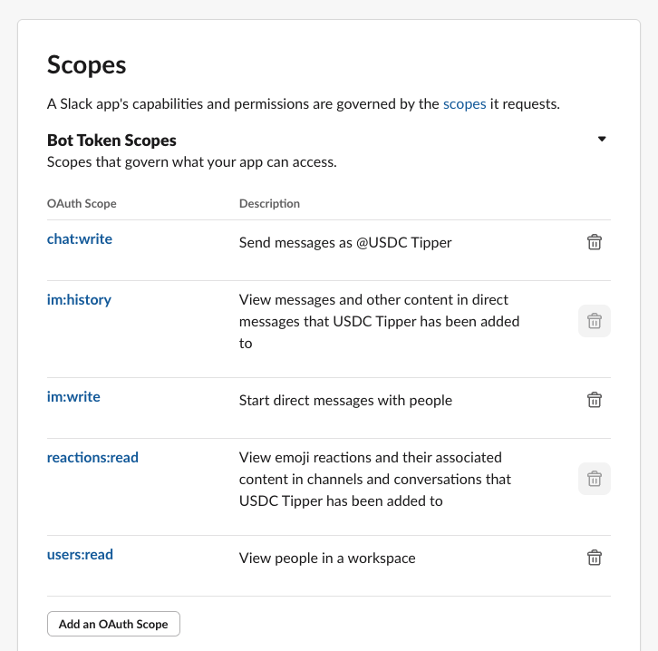

# Setup

Go to https://api.slack.com/apps and create a new Slack app. Choose "From scratch" and give it a name and workspace. You can either copy the manifest below or configure the app manually in the Slack UI.

You can copy and paste the following manifest to quickly set up the app:

```json
{
    "display_information": {
        "name": "USDC Tipper",
        "description": "Tip each other 0.01 USDC",
        "background_color": "#1c4ad6",
        "long_description": "Give USDC tips to anybody in a channel that I am in. My admin wallet is at 0x03683E177Ff30Ee38f9f8011A02252140B5e83eC so send me some Base ETH or USDC directly to top up my fuel tank to power these daily free tips ⛽️."
    },
    "features": {
        "app_home": {
            "home_tab_enabled": true,
            "messages_tab_enabled": true,
            "messages_tab_read_only_enabled": false
        },
        "bot_user": {
            "display_name": "USDC Tipper",
            "always_online": true
        }
    },
    "oauth_config": {
        "scopes": {
            "bot": [
                "im:history",
                "reactions:read",
                "chat:write",
                "users:read",
                "im:write"
            ]
        }
    },
    "settings": {
        "event_subscriptions": {
            "bot_events": [
                "app_home_opened",
                "message.im",
                "reaction_added"
            ]
        },
        "interactivity": {
            "is_enabled": true
        },
        "org_deploy_enabled": false,
        "socket_mode_enabled": true,
        "token_rotation_enabled": false
    }
}
```

Once your app is created, install it to your workspace. Remember you need to fund the admin wallet with some Base USDC or ETH to pay for gas fees when users tip each other.

## Manual Setup Steps

Create an app-level token with the `connections:write` scope and enable Socket Mode in your Slack app settings. This allows the bot to connect to Slack without needing a bot token.



Add "app_home_opened" , "message.im", and "reaction_added" event subscriptions in your Slack app settings. This enables the bot to respond to direct messages, emoji reactions, and App Home events.


Add "chat:write", "reactions:read", "users:read", "im:write", and "im:history" OAuth scopes to your Slack app. These permissions allow the bot to send messages, read reactions, manage user info, and interact with the App Home tab.
